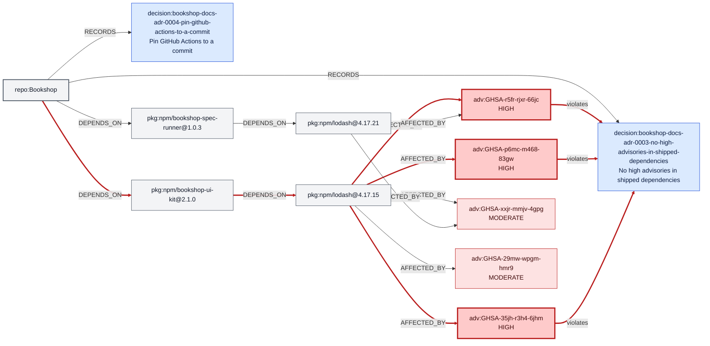

```mermaid
flowchart LR
  n0["repo:Bookshop"]
  n1["decision:bookshop-docs-adr-0004-pin-github-actions-to-a-commit<br/>Pin GitHub Actions to a commit"]
  n2["decision:bookshop-docs-adr-0003-no-high-advisories-in-shipped-dependencies<br/>No high advisories in shipped dependencies"]
  n3["pkg:npm/bookshop-ui-kit@2.1.0"]
  n4["pkg:npm/lodash@4.17.15"]
  n5["adv:GHSA-r5fr-rjxr-66jc<br/>HIGH"]
  n6["adv:GHSA-p6mc-m468-83gw<br/>HIGH"]
  n7["adv:GHSA-35jh-r3h4-6jhm<br/>HIGH"]
  n8["pkg:npm/bookshop-spec-runner@1.0.3"]
  n9["pkg:npm/lodash@4.17.21"]
  n10["adv:GHSA-xxjr-mmjv-4gpg<br/>MODERATE"]
  n11["adv:GHSA-29mw-wpgm-hmr9<br/>MODERATE"]
  n0 -->|"RECORDS"| n1
  n0 -->|"RECORDS"| n2
  n0 -->|"DEPENDS_ON"| n3
  n3 -->|"DEPENDS_ON"| n4
  n4 -->|"AFFECTED_BY"| n5
  n5 -->|"violates"| n2
  n4 -->|"AFFECTED_BY"| n6
  n6 -->|"violates"| n2
  n4 -->|"AFFECTED_BY"| n7
  n7 -->|"violates"| n2
  n0 -->|"DEPENDS_ON"| n8
  n8 -->|"DEPENDS_ON"| n9
  n9 -->|"AFFECTED_BY"| n5
  n4 -->|"AFFECTED_BY"| n10
  n4 -->|"AFFECTED_BY"| n11
  n9 -->|"AFFECTED_BY"| n10
  classDef advisory fill:#fde2e2,stroke:#b91c1c,color:#3f0a0a
  classDef decision fill:#dbeafe,stroke:#1d4ed8,color:#0b1b3f
  classDef package fill:#f3f4f6,stroke:#4b5563,color:#111827
  classDef repository fill:#f3f4f6,stroke:#4b5563,stroke-width:2px,color:#111827
  classDef violated fill:#fecaca,stroke:#b91c1c,stroke-width:3px,color:#3f0a0a
  class n10,n11 advisory
  class n1,n2 decision
  class n3,n4,n8,n9 package
  class n0 repository
  class n5,n6,n7 violated
  linkStyle 2,3,4,5,6,7,8,9 stroke:#b91c1c,stroke-width:3px
```
