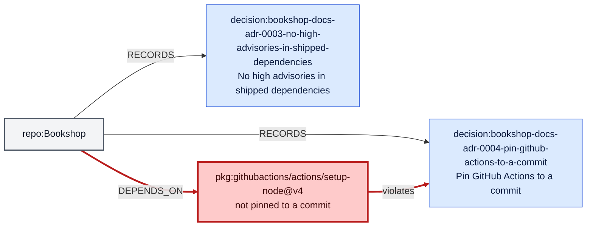

```mermaid
flowchart LR
  n0["repo:Bookshop"]
  n1["decision:bookshop-docs-adr-0004-pin-github-actions-to-a-commit<br/>Pin GitHub Actions to a commit"]
  n2["decision:bookshop-docs-adr-0003-no-high-advisories-in-shipped-dependencies<br/>No high advisories in shipped dependencies"]
  n3["pkg:githubactions/actions/setup-node@v4<br/>not pinned to a commit"]
  n0 -->|"RECORDS"| n1
  n0 -->|"RECORDS"| n2
  n0 -->|"DEPENDS_ON"| n3
  n3 -->|"violates"| n1
  classDef decision fill:#dbeafe,stroke:#1d4ed8,color:#0b1b3f
  classDef repository fill:#f3f4f6,stroke:#4b5563,stroke-width:2px,color:#111827
  classDef violated fill:#fecaca,stroke:#b91c1c,stroke-width:3px,color:#3f0a0a
  class n1,n2 decision
  class n0 repository
  class n3 violated
  linkStyle 2,3 stroke:#b91c1c,stroke-width:3px
```
