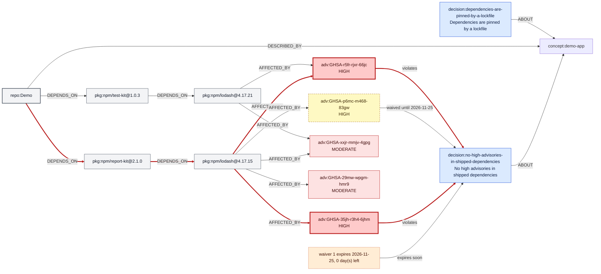

```mermaid
flowchart LR
  n0["repo:Demo"]
  n1["decision:dependencies-are-pinned-by-a-lockfile<br/>Dependencies are pinned by a lockfile"]
  n2["concept:demo-app"]
  n3["decision:no-high-advisories-in-shipped-dependencies<br/>No high advisories in shipped dependencies"]
  n4["pkg:npm/test-kit@1.0.3"]
  n5["pkg:npm/lodash@4.17.21"]
  n6["adv:GHSA-r5fr-rjxr-66jc<br/>HIGH"]
  n7["pkg:npm/report-kit@2.1.0"]
  n8["pkg:npm/lodash@4.17.15"]
  n9["adv:GHSA-p6mc-m468-83gw<br/>HIGH"]
  n10["adv:GHSA-35jh-r3h4-6jhm<br/>HIGH"]
  n11["adv:GHSA-xxjr-mmjv-4gpg<br/>MODERATE"]
  n12["adv:GHSA-29mw-wpgm-hmr9<br/>MODERATE"]
  n13["waiver 1 expires 2026-11-25, 0 day(s) left"]
  n1 -->|"ABOUT"| n2
  n0 -->|"DESCRIBED_BY"| n2
  n3 -->|"ABOUT"| n2
  n0 -->|"DEPENDS_ON"| n4
  n4 -->|"DEPENDS_ON"| n5
  n5 -->|"AFFECTED_BY"| n6
  n0 -->|"DEPENDS_ON"| n7
  n7 -->|"DEPENDS_ON"| n8
  n8 -->|"AFFECTED_BY"| n6
  n6 -->|"violates"| n3
  n8 -->|"AFFECTED_BY"| n9
  n9 -->|"waived until 2026-11-25"| n3
  n8 -->|"AFFECTED_BY"| n10
  n10 -->|"violates"| n3
  n5 -->|"AFFECTED_BY"| n11
  n8 -->|"AFFECTED_BY"| n11
  n8 -->|"AFFECTED_BY"| n12
  n13 -->|"expires soon"| n3
  classDef advisory fill:#fde2e2,stroke:#b91c1c,color:#3f0a0a
  classDef decision fill:#dbeafe,stroke:#1d4ed8,color:#0b1b3f
  classDef expiring fill:#ffedd5,stroke:#c2410c,stroke-dasharray:2 2,color:#431407
  classDef package fill:#f3f4f6,stroke:#4b5563,color:#111827
  classDef repository fill:#f3f4f6,stroke:#4b5563,stroke-width:2px,color:#111827
  classDef violated fill:#fecaca,stroke:#b91c1c,stroke-width:3px,color:#3f0a0a
  classDef waived fill:#fef9c3,stroke:#a16207,stroke-dasharray:4 3,color:#3b2603
  class n11,n12 advisory
  class n1,n3 decision
  class n13 expiring
  class n4,n5,n7,n8 package
  class n0 repository
  class n6,n10 violated
  class n9 waived
  linkStyle 6,7,8,9,12,13 stroke:#b91c1c,stroke-width:3px
```
