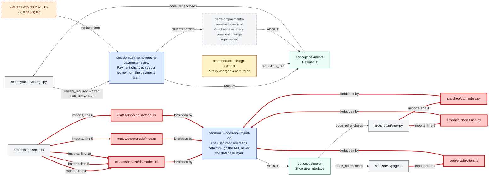

```mermaid
flowchart LR
  n0["crates/shop/src/ui.rs"]
  n1["src/payments/charge.py"]
  n2["concept:payments<br/>Payments"]
  n3["decision:payments-need-a-payments-review<br/>Payment changes need a review from the payments team"]
  n4["record:double-charge-incident<br/>A retry charged a card twice"]
  n5["decision:payments-reviewed-by-carol<br/>Carol reviews every payment change<br/>superseded"]
  n6["src/shop/ui/view.py"]
  n7["concept:shop-ui<br/>Shop user interface"]
  n8["decision:ui-does-not-import-db<br/>The user interface reads data through the API, never the database layer"]
  n9["web/src/ui/page.ts"]
  n10["crates/shop/src/db/models.rs"]
  n11["crates/shop/src/db/mod.rs"]
  n12["crates/shop-db/src/pool.rs"]
  n13["src/shop/db/models.py"]
  n14["src/shop/db/session.py"]
  n15["web/src/db/client.ts"]
  n16["waiver 1 expires 2026-11-25, 0 day(s) left"]
  n2 -->|"code_ref encloses"| n1
  n3 -->|"ABOUT"| n2
  n4 -->|"RELATED_TO"| n2
  n5 -->|"ABOUT"| n2
  n3 -->|"SUPERSEDES"| n5
  n7 -->|"code_ref encloses"| n6
  n8 -->|"ABOUT"| n7
  n7 -->|"code_ref encloses"| n9
  n0 -->|"imports, line 4"| n10
  n10 -->|"forbidden by"| n8
  n0 -->|"imports, line 5"| n11
  n11 -->|"forbidden by"| n8
  n0 -->|"imports, line 5"| n10
  n0 -->|"imports, line 6"| n12
  n12 -->|"forbidden by"| n8
  n0 -->|"imports, line 18"| n10
  n6 -->|"imports, line 4"| n13
  n13 -->|"forbidden by"| n8
  n6 -->|"imports, line 5"| n14
  n14 -->|"forbidden by"| n8
  n9 -->|"imports, line 1"| n15
  n15 -->|"forbidden by"| n8
  n1 -->|"review_required waived until 2026-11-25"| n3
  n16 -->|"expires soon"| n3
  classDef code fill:#f3f4f6,stroke:#4b5563,color:#111827
  classDef concept fill:#ecfdf5,stroke:#047857,color:#032b1f
  classDef decision fill:#dbeafe,stroke:#1d4ed8,color:#0b1b3f
  classDef expiring fill:#ffedd5,stroke:#c2410c,stroke-dasharray:2 2,color:#431407
  classDef record fill:#fef3c7,stroke:#b45309,color:#3b2603
  classDef superseded fill:#f3f4f6,stroke:#9ca3af,stroke-dasharray:4 3,color:#4b5563
  classDef violated fill:#fecaca,stroke:#b91c1c,stroke-width:3px,color:#3f0a0a
  class n0,n1,n6,n9 code
  class n2,n7 concept
  class n3,n8 decision
  class n16 expiring
  class n4 record
  class n5 superseded
  class n10,n11,n12,n13,n14,n15 violated
  linkStyle 8,9,10,11,12,13,14,15,16,17,18,19,20,21 stroke:#b91c1c,stroke-width:3px
```
