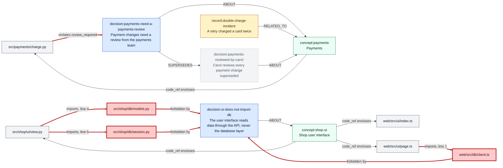

```mermaid
flowchart LR
  n0["src/payments/charge.py"]
  n1["concept:payments<br/>Payments"]
  n2["decision:payments-need-a-payments-review<br/>Payment changes need a review from the payments team"]
  n3["record:double-charge-incident<br/>A retry charged a card twice"]
  n4["decision:payments-reviewed-by-carol<br/>Carol reviews every payment change<br/>superseded"]
  n5["src/shop/ui/view.py"]
  n6["concept:shop-ui<br/>Shop user interface"]
  n7["decision:ui-does-not-import-db<br/>The user interface reads data through the API, never the database layer"]
  n8["web/src/ui/index.ts"]
  n9["web/src/ui/page.ts"]
  n10["src/shop/db/models.py"]
  n11["src/shop/db/session.py"]
  n12["web/src/db/client.ts"]
  n1 -->|"code_ref encloses"| n0
  n2 -->|"ABOUT"| n1
  n3 -->|"RELATED_TO"| n1
  n4 -->|"ABOUT"| n1
  n2 -->|"SUPERSEDES"| n4
  n6 -->|"code_ref encloses"| n5
  n7 -->|"ABOUT"| n6
  n6 -->|"code_ref encloses"| n8
  n6 -->|"code_ref encloses"| n9
  n0 -->|"violates review_required"| n2
  n5 -->|"imports, line 4"| n10
  n10 -->|"forbidden by"| n7
  n5 -->|"imports, line 5"| n11
  n11 -->|"forbidden by"| n7
  n9 -->|"imports, line 1"| n12
  n12 -->|"forbidden by"| n7
  classDef code fill:#f3f4f6,stroke:#4b5563,color:#111827
  classDef concept fill:#ecfdf5,stroke:#047857,color:#032b1f
  classDef decision fill:#dbeafe,stroke:#1d4ed8,color:#0b1b3f
  classDef record fill:#fef3c7,stroke:#b45309,color:#3b2603
  classDef superseded fill:#f3f4f6,stroke:#9ca3af,stroke-dasharray:4 3,color:#4b5563
  classDef violated fill:#fecaca,stroke:#b91c1c,stroke-width:3px,color:#3f0a0a
  class n0,n5,n8,n9 code
  class n1,n6 concept
  class n2,n7 decision
  class n3 record
  class n4 superseded
  class n10,n11,n12 violated
  linkStyle 9,10,11,12,13,14,15 stroke:#b91c1c,stroke-width:3px
```
