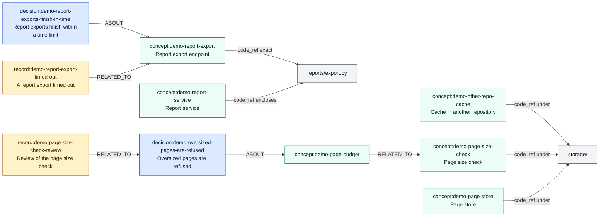

```mermaid
flowchart LR
  n0["reports/export.py"]
  n1["concept:demo-report-export<br/>Report export endpoint"]
  n2["concept:demo-report-service<br/>Report service"]
  n3["decision:demo-report-exports-finish-in-time<br/>Report exports finish within a time limit"]
  n4["record:demo-report-export-timed-out<br/>A report export timed out"]
  n5["storage/"]
  n6["concept:demo-other-repo-cache<br/>Cache in another repository"]
  n7["concept:demo-page-size-check<br/>Page size check"]
  n8["concept:demo-page-store<br/>Page store"]
  n9["decision:demo-oversized-pages-are-refused<br/>Oversized pages are refused"]
  n10["concept:demo-page-budget"]
  n11["record:demo-page-size-check-review<br/>Review of the page size check"]
  n1 -->|"code_ref exact"| n0
  n2 -->|"code_ref encloses"| n0
  n3 -->|"ABOUT"| n1
  n4 -->|"RELATED_TO"| n1
  n6 -->|"code_ref under"| n5
  n7 -->|"code_ref under"| n5
  n8 -->|"code_ref under"| n5
  n10 -->|"RELATED_TO"| n7
  n9 -->|"ABOUT"| n10
  n11 -->|"RELATED_TO"| n9
  classDef code fill:#f3f4f6,stroke:#4b5563,color:#111827
  classDef concept fill:#ecfdf5,stroke:#047857,color:#032b1f
  classDef decision fill:#dbeafe,stroke:#1d4ed8,color:#0b1b3f
  classDef record fill:#fef3c7,stroke:#b45309,color:#3b2603
  class n0,n5 code
  class n1,n2,n6,n7,n8,n10 concept
  class n3,n9 decision
  class n4,n11 record
```
