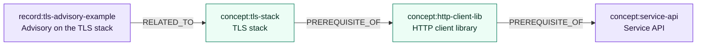

```mermaid
flowchart LR
  n0["record:tls-advisory-example<br/>Advisory on the TLS stack"]
  n1["concept:tls-stack<br/>TLS stack"]
  n2["concept:http-client-lib<br/>HTTP client library"]
  n3["concept:service-api<br/>Service API"]
  n0 -->|"RELATED_TO"| n1
  n1 -->|"PREREQUISITE_OF"| n2
  n2 -->|"PREREQUISITE_OF"| n3
  classDef concept fill:#ecfdf5,stroke:#047857,color:#032b1f
  classDef endpoint fill:#ede9fe,stroke:#6d28d9,color:#1e1037
  class n1,n2 concept
  class n0,n3 endpoint
```
